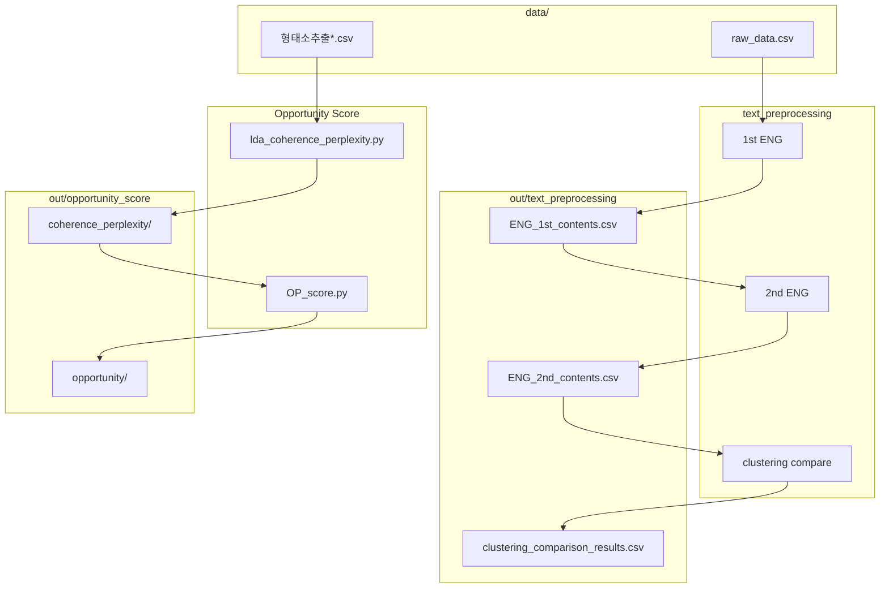

# DCX — 텍스트 분석 파이프라인

냄새(smell / fragrance / scent) 도메인 텍스트를 **전처리 → 토픽 선별 → 클러스터링 비교 → Opportunity Score**까지 분석하는 모노레포입니다.

입력 데이터는 `data/`, 실행 결과·캐시는 `out/`에 모듈별로 저장합니다.

## 프로젝트 구조

```
DCX/
├── README.md
├── .gitignore
├── data/                              # 입력 데이터 (로컬·대용량)
│   ├── text_preprocessing/
│   │   └── raw_data.csv               # 1차 전처리용 더미 샘플 (Git 추적)
│   └── opportunity_score/
│       ├── 형태소추출.csv
│       ├── 형태소추출_수정본.csv
│       ├── SentiWord_info.json
│       └── 클러스터{1~4}_tf_idf.csv
├── out/                               # 산출물·캐시 (Git 제외, 실행 시 생성)
│   ├── text_preprocessing/
│   │   ├── ENG_1st_contents.csv
│   │   ├── ENG_2nd_contents.csv
│   │   ├── ENG_1st_embeddings.npy
│   │   ├── topic_examples_20*.csv/xlsx
│   │   ├── compare_emb_*.npy
│   │   └── clustering_comparison_results.csv
│   └── opportunity_score/
│       ├── coherence_perplexity/      # LDA k 탐색 결과
│       └── opportunity/               # Opportunity Score·그래프
├── text_preprocessing/                # 영문 전처리·클러스터링 노트북
│   ├── text_preprocessing_1st_ENG.ipynb
│   ├── text_preprocessing_2nd_ENG.ipynb
│   ├── embedding_clustering_comparison_ENG.ipynb
│   └── README.md
└── Oppertunity Score/                 # Actor-Action Opportunity Score
    ├── lda_coherence_perplexity.py
    ├── OP_score.py
    ├── organize_files.py
    ├── requirements.txt
    └── README.md
```

## 데이터 경로 요약

| 모듈 | 입력 (`data/`) | 출력 (`out/`) |
| --- | --- | --- |
| **1차 전처리** | `data/text_preprocessing/raw_data.csv` | `out/text_preprocessing/ENG_1st_contents.csv` |
| **2차 전처리** | `out/text_preprocessing/ENG_1st_contents.csv` | `out/text_preprocessing/ENG_2nd_contents.csv` |
| **임베딩×클러스터링** | `out/text_preprocessing/ENG_2nd_contents.csv` | `out/text_preprocessing/clustering_comparison_results.csv` |
| **LDA k 탐색** | `data/opportunity_score/형태소추출_수정본.csv` | `out/opportunity_score/coherence_perplexity/` |
| **Opportunity Score** | `data/opportunity_score/형태소추출.csv` + LDA 결과 | `out/opportunity_score/opportunity/` |

노트북·스크립트는 **DCX 루트** 기준으로 `data/` · `out/` 경로를 자동 해석합니다. Jupyter는 `text_preprocessing/` 폴더에서 실행해도 됩니다.

## 실행 순서

### 1. 영문 텍스트 전처리 (Jupyter)

```bash
cd text_preprocessing
jupyter notebook
```

1. `text_preprocessing_1st_ENG.ipynb` — 원본 CSV 정제 → `ENG_1st_contents.csv`
2. `text_preprocessing_2nd_ENG.ipynb` — BERTopic 토픽 선별 → `ENG_2nd_contents.csv`
3. `embedding_clustering_comparison_ENG.ipynb` — 임베딩×클러스터링 12조합 비교

상세 설정·모델·트러블슈팅은 [`text_preprocessing/README.md`](text_preprocessing/README.md) 참고.

### 2. Opportunity Score (Python)

```bash
cd "Oppertunity Score"
pip install -r requirements.txt
python lda_coherence_perplexity.py   # 1단계: LDA + Action 분류
python OP_score.py                   # 2단계: 점수 계산 + 시각화
```

상세 설명은 [`Oppertunity Score/README.md`](Oppertunity%20Score/README.md) 참고.

## 원본 데이터 교체

### text_preprocessing

1. 실제 원본 CSV를 `data/text_preprocessing/`에 넣습니다.
2. `text_preprocessing_1st_ENG.ipynb` 설정 셀에서 `RAW_CSV_PATH`, `TITLE_COL`, `CONTENT_COL`, `COMMENT_COL`을 맞춥니다.
3. `out/text_preprocessing/`의 기존 산출물·`.npy` 캐시를 삭제한 뒤 노트북을 처음부터 실행합니다.

### opportunity_score

- `data/opportunity_score/형태소추출.csv`와 `형태소추출_수정본.csv`의 **행 순서(row_id)** 가 일치해야 LDA Action 매칭이 정확합니다.
- 대용량 CSV·JSON은 Git에 포함되지 않습니다. 로컬에 직접 배치하세요.

## Git 추적 정책

| 추적 | 제외 |
| --- | --- |
| 소스 코드, 노트북, README | `out/` 전체 |
| `data/text_preprocessing/raw_data.csv` (더미) | `data/opportunity_score/` (대용량) |
| | `*.npy`, `.ipynb_checkpoints`, `__pycache__/` |

## 요구사항

- Python 3.10+
- GPU(CUDA / Apple MPS) 권장 — 전처리 분류기·임베딩·LDA에서 속도 차이 큼
- Windows 한글 그래프: 맑은 고딕 등 한글 폰트 필요 (Opportunity Score)

## 파이프라인 흐름


